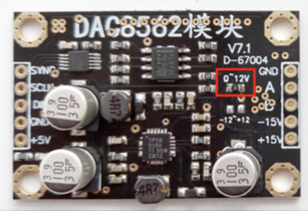

# DAC8562
A simple Arduino library for 16bit SPI controlled DAC

I am currently using a breakout board look like this:
 

Ideally it should work with all the DAC8562 chip.

## Credits
This library use @machinesalem 's TLV5618 DAC library as reference.
